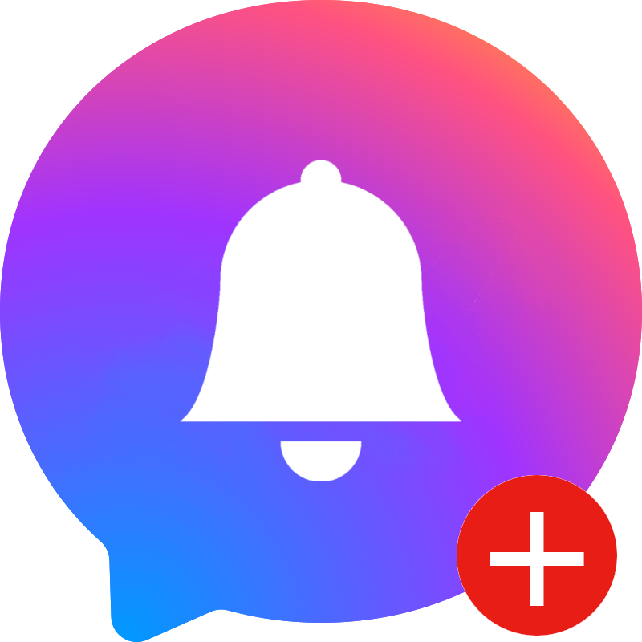

<h1 align="center"> Messenger Web App Upgrades</h1>
<p align="center">Set a custom notification sound for Messenger!</a></p>

<p align="center">
<a href="https://chromewebstore.google.com/detail/"></a>
</p>

<hr /><br />

Messenger Web App Upgrades adds more features for [Messenger.com](https://www.messenger.com):
- Set a custom notification sound for new messages
- Press the Escape key to close chats
- Unread badges (if the app is installed as a PWA)

Install and launch the extension, configure settings as desired, then refresh Messenger for the changes to take effect.

Uploaded audio data is stored exclusively on-device. Additonally, the extension does not collect data or report back to any server or cloud service.


## Setup / Installation Steps

### Option 1: Install from the Chrome Web Store
- Navigate to https://chromewebstore.google.com/detail/
- Click "Add to Chrome"

### Option 2: Install Unpacked Extension
- Clone this repository by running the following commands from a terminal:
  ```bash
  git clone https://github.com/mejia-dev/Messenger-Web-App-Upgrades.git

  cd src/mwau-popup

  npm install

  npm run build
  ```
- Open Google Chrome and navigate to `chrome://extensions` in the address bar
- Click the toggle in the top-right corner of the screen to activate "Developer mode".
- Click the "Load unpacked" button.
- In the file picker that appears, select the `src` folder of the cloned repository.


## More Information

View the [Changelog](CHANGELOG.md)

Report issues in the [Issue Tracker](https://github.com/mejia-dev/Messenger-Web-App-Upgrades/issues?state=open)

Disclaimer: This extension is not in any way affiliated with, associated with, authorized, or endorsed by Facebook or Meta Platforms, Inc. Facebook Messenger is a registered trademark of Meta Platforms, Inc.

Copyright (C) 2024 Aaron Mejia<br/>
Open Source under the [GPLv3 License](LICENSE.txt).